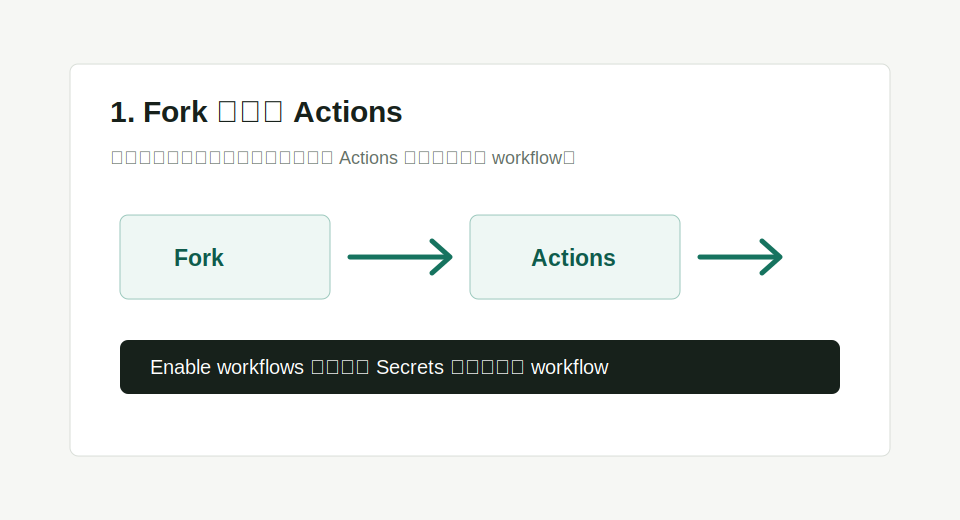
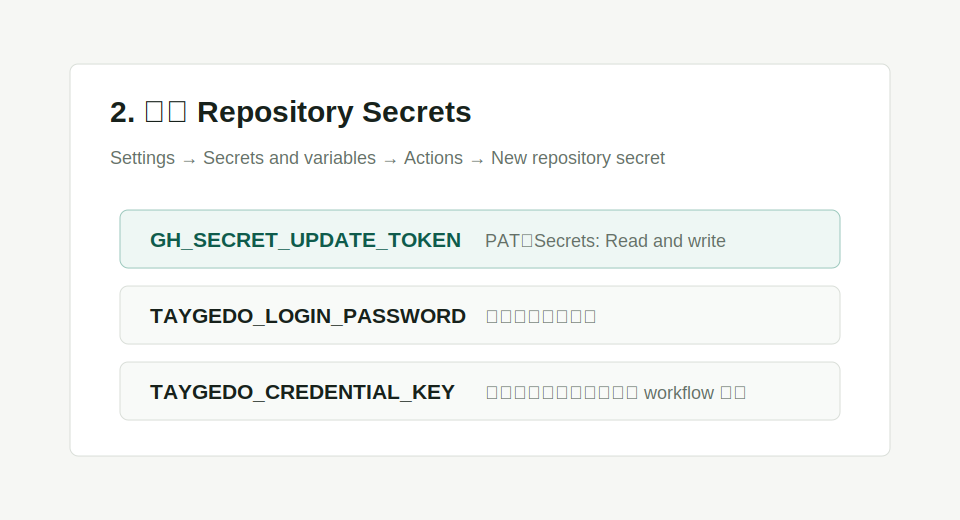
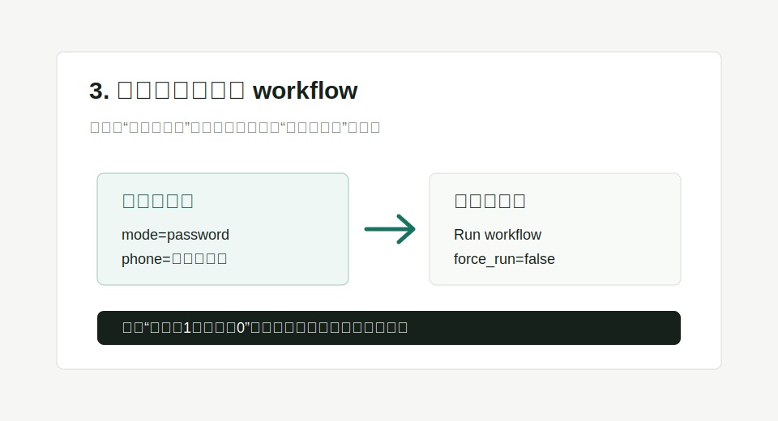

# 塔吉多自动签到

使用 TypeScript 实现的塔吉多自动签到工具，支持多账号、自动重登、通知推送和多种自托管部署方式。

支持平台：GitHub Actions、Cloudflare Workers、腾讯云 / 阿里云云函数、Docker、本地 CLI。默认尝试签到全部已知游戏 `1256`、`1257`、`1289`。

## 功能特点

- 支持多账号签到和账号配置自动写回
- 支持 GitHub Actions 定时签到和手动触发
- 支持 Cloudflare Workers 定时任务、HTTP 手动触发、Web 登录页和 KV 存储
- 支持腾讯云 SCF / 阿里云 FC 定时云函数，使用 Upstash Redis REST 持久化账号和状态
- 支持 Docker / Docker Compose 和本地 CLI
- 支持短信验证码登录、账号密码登录
- 支持 APP 签到、游戏签到、塔吉多金币任务和云异环每日时长
- 支持普通 webhook 和 Server 酱通知

## 快速开始

选择一种部署方式，展开对应步骤即可。不同部署方式使用同一套账号 JSON 格式；密码可以加密写入账号配置，解密密钥单独放在 Secret、环境变量或本地密钥文件里。

### Cloudflare Workers 部署

适合希望长期托管在 Serverless 平台的用户。使用 KV 保存账号和运行状态，支持定时任务、HTTP 手动触发和 Web 登录页。

[](https://deploy.workers.cloudflare.com/?url=https://github.com/zzstar101/taygedo-auto-attendance)

<details>
<summary>展开查看详细步骤</summary>

部署页面只需要填写以下两个 Secret。建议分别运行一次 `openssl rand -hex 32`，生成两段不同的随机字符串：

```text
TAYGEDO_ADMIN_TOKEN=第一段随机字符串
TAYGEDO_CREDENTIAL_KEY=第二段随机字符串
```

> 安全提醒：`TAYGEDO_CREDENTIAL_KEY` 必须使用高强度随机密钥，不要使用手机号、生日、短密码或常用短语。它只需要保存在 Cloudflare Secret 中供 Worker 解密账号密码使用，不需要自己记住；丢失后重新 password 登录生成新的加密密码即可。

KV 命名空间会由 Cloudflare 自动创建和绑定。账号、通知地址、重试次数等可选配置不需要在首次部署时填写；账号可以在部署完成后通过 Worker 登录页写入 KV。

可选：

```text
TAYGEDO_ACCOUNTS=[账号 JSON]
TAYGEDO_NOTIFICATION_URLS=webhook 地址
TAYGEDO_SERVERCHAN_SENDKEY=Server 酱 SendKey
```

Worker 使用绑定名为 `KV` 的 Cloudflare KV。可以从 `TAYGEDO_ACCOUNTS` 初始化，也可以通过登录接口生成账号配置。

访问 Worker 根路径可以打开 Web 登录页：

```text
https://你的-worker.workers.dev/
```

登录页仅 Cloudflare Worker 支持，用 `TAYGEDO_ADMIN_TOKEN` 授权。密码登录可以直接提交；验证码登录会在同一页面先发送验证码，再自动复用设备信息完成登录，并把生成的账号配置写入 KV。

通过密码登录并写入 KV：

```bash
curl -X POST \
  -H "Authorization: Bearer <TAYGEDO_ADMIN_TOKEN>" \
  -H "Content-Type: application/json" \
  -d '{"mode":"password","phone":"13800138000","password":"你的塔吉多密码","accountId":"main","accountName":"主账号"}' \
  https://你的-worker.workers.dev/login
```

手动触发签到：

```bash
curl -H "Authorization: Bearer <TAYGEDO_ADMIN_TOKEN>" https://你的-worker.workers.dev/run
```

强制忽略今日去重并重跑：

```bash
curl -H "Authorization: Bearer <TAYGEDO_ADMIN_TOKEN>" "https://你的-worker.workers.dev/run?force=1"
```

</details>

### 腾讯云 / 阿里云云函数部署

适合把云函数当作 GitHub Actions 的替代定时任务使用。云函数版只负责定时签到，不提供 HTTP 手动触发、登录页或管理接口；账号、刷新后的 token、每日去重状态都必须写入 Upstash Redis REST。

<details>
<summary>展开查看详细步骤</summary>

#### 1. 准备账号 JSON

先用本地 CLI 或 Docker 生成账号配置。推荐先在本地确认能正常签到，再部署云函数。

```bash
pnpm install
pnpm local login \
  --mode password \
  --phone 13800138000 \
  --account-id main \
  --account-name 主账号 \
  --accounts-file accounts.json
```

如果账号里包含 `encryptedPassword`，云函数环境变量里必须配置同一段 `TAYGEDO_CREDENTIAL_KEY`。

#### 2. 创建 Upstash Redis

1. 打开 <https://console.upstash.com/> 并创建 Redis 数据库。
2. 进入数据库详情，复制 **REST URL** 和 **REST Token**。
3. 云函数不需要挂载 Upstash，也不需要 Redis TCP 连接；只要函数能访问公网 HTTPS 即可。

账号初始化有两种方式。

小账号配置可以把 `accounts.json` 内容临时放入云函数环境变量：

```text
TAYGEDO_ACCOUNTS=[accounts.json 的完整 JSON]
```

首次运行时程序会把它写入 Upstash 的 `TAYGEDO_ACCOUNTS` key。确认 Upstash 已有账号配置后，可以删除云函数里的 `TAYGEDO_ACCOUNTS`，避免环境变量过长。

账号 JSON 较大时，建议直接从本地写入 Upstash，避开云函数环境变量大小限制：

```bash
curl -X POST \
  -H "Authorization: Bearer <UPSTASH_REDIS_REST_TOKEN>" \
  --data-binary @accounts.json \
  "<UPSTASH_REDIS_REST_URL>/set/TAYGEDO_ACCOUNTS"
```

验证写入：

```bash
curl -H "Authorization: Bearer <UPSTASH_REDIS_REST_TOKEN>" \
  "<UPSTASH_REDIS_REST_URL>/get/TAYGEDO_ACCOUNTS"
```

#### 3. 构建上传包

```bash
pnpm install
pnpm cloud:function:pack
```

上传 `dist/cloud-function.zip`。压缩包根目录包含 `index.js`，入口方法固定填写：

```text
index.main_handler
```

#### 4. 配置环境变量

必填：

| 变量名 | 说明 |
| --- | --- |
| `TAYGEDO_UPSTASH_REDIS_REST_URL` | Upstash Redis 的 REST URL |
| `TAYGEDO_UPSTASH_REDIS_REST_TOKEN` | Upstash Redis 的 REST Token |
| `TAYGEDO_CREDENTIAL_KEY` | 解密账号加密密码用的密钥 |

可选：

| 变量名 | 说明 |
| --- | --- |
| `TAYGEDO_ACCOUNTS` | 仅首次初始化 Upstash 时使用 |
| `TAYGEDO_ACCOUNTS_KEY` | Upstash 账号 key，默认 `TAYGEDO_ACCOUNTS` |
| `TAYGEDO_STATE_PREFIX` | Upstash 状态前缀，默认 `taygedo` |
| `TAYGEDO_NOTIFICATION_URLS` | 普通 webhook，多个用英文逗号分隔 |
| `TAYGEDO_SERVERCHAN_SENDKEY` | Server 酱 SendKey |
| `TAYGEDO_MAX_RETRIES` | 单账号最大重试次数，默认 `3` |
| `TAYGEDO_ACCOUNT_CONCURRENCY` | 多账号并发数，默认 `1`，可设为 `2` 压缩多号耗时 |
| `TAYGEDO_COIN_TASKS` | 是否执行金币任务，默认 `true` |
| `TAYGEDO_CLOUD_DURATION` | 是否领取云异环每日时长，默认 `true` |
| `TAYGEDO_SHARE_PLATFORM` | 分享平台，默认 `qq` |

云函数版会强制使用 Upstash，不需要配置 `TAYGEDO_ACCOUNT_STORE` 和 `TAYGEDO_STATE_STORE`。

#### 5. 腾讯云 SCF

1. 创建事件函数，运行环境选择 Node.js 18.15 或 Node.js 20.19。
2. 上传 `dist/cloud-function.zip`。
3. 执行方法填写 `index.main_handler`。
4. 超时时间建议设置为 `300 秒`。
5. 添加上面的环境变量。
6. 创建定时触发器，例如每天北京时间凌晨后执行一次。

腾讯云定时触发器会异步调用函数；日志里看到 `塔吉多每日签到结果` 即表示执行完成。

#### 6. 阿里云 FC

1. 创建事件函数，请求处理程序类型选择处理事件请求。
2. 运行环境选择 Node.js 18 或 Node.js 20。
3. 上传 `dist/cloud-function.zip`。
4. 请求处理程序填写 `index.main_handler`。
5. 超时时间建议设置为 `300 秒`。
6. 添加上面的环境变量。
7. 创建定时触发器，调用方式选择异步调用。

阿里云定时触发器只需要事件函数，不需要 HTTP 触发器。日志里看到 `塔吉多每日签到结果` 即表示执行完成。

</details>

### GitHub Actions 部署

适合第一次使用 GitHub 的用户。Fork 后配置 Secrets，就可以每天自动签到。

<details>
<summary>展开查看详细步骤</summary>

#### 1. Fork 仓库

点击页面右上角 **Fork**，把仓库复制到自己的 GitHub 账号下。

#### 2. 启用 Actions

进入 Fork 后的仓库，打开 **Actions**。如果 GitHub 提示启用 workflow，点击确认启用。



#### 3. 创建 GitHub PAT

这个 token 用来让 workflow 自动更新账号 Secret。

1. 打开 GitHub 右上角头像 -> **Settings**
2. 进入 **Developer settings** -> **Personal access tokens**
3. 创建一个 fine-grained token
4. Repository access 选择你 Fork 的仓库
5. Repository permissions 里把 **Secrets** 设为 **Read and write**
6. 复制生成的 token

#### 4. 配置 GitHub Secrets

进入 Fork 后仓库：

```text
Settings -> Secrets and variables -> Actions -> New repository secret
```

添加：



| Secret 名称 | 说明 | 是否必填 |
| --- | --- | --- |
| `GH_SECRET_UPDATE_TOKEN` | 上一步生成的 GitHub PAT，用于写回 `TAYGEDO_ACCOUNTS` | 必填 |
| `TAYGEDO_LOGIN_PASSWORD` | 密码登录输入；首次 password 登录后不会写入账号 JSON | 推荐 |
| `TAYGEDO_CREDENTIAL_KEY` | 密码加密密钥；首次 password 登录可自动生成并写回 Secret | 自动生成 |
| `TAYGEDO_PASSWORDS` | 不使用加密存储时的多账号密码映射，例如 `{"main":"密码"}` | 可选 |
| `TAYGEDO_NOTIFICATION_URLS` | 普通 webhook，多个用英文逗号分隔 | 可选 |
| `TAYGEDO_SERVERCHAN_SENDKEY` | Server 酱 SendKey | 可选 |
| `TAYGEDO_MAX_RETRIES` | 单账号最大重试次数，默认 `3` | 可选 |
| `TAYGEDO_ACCOUNT_CONCURRENCY` | 多账号并发数，默认 `1` | 可选 |
| `TAYGEDO_CLOUD_DURATION` | 是否领取云异环每日时长，默认 `true` | 可选 |

#### 5. 添加账号

进入 **Actions** -> **塔吉多登录** -> **Run workflow**。

推荐使用密码模式：

```text
mode=password
phone=你的手机号
account_id=main
account_name=主账号
```

`mode`、`account_id`、`account_name` 已有默认值，第一次通常只需要填手机号。`password` 输入框可以留空，workflow 会读取 `TAYGEDO_LOGIN_PASSWORD` Secret。

运行成功后，会自动创建或更新 `TAYGEDO_ACCOUNTS` Secret。

#### 6. 执行签到

进入 **Actions** -> **塔吉多签到** -> **Run workflow**。如果需要忽略今日去重并补跑，把 `force_run` 设为 `true`。



看到类似下面的日志就说明部署完成：

```text
塔吉多每日签到结果
总账号：1，成功：1，失败：0
```

之后 workflow 会按计划每天自动运行。定时运行时会自动调用 `liskin/gh-workflow-keepalive@v1`，防止仓库长期无活动导致 GitHub Actions 被停用，且不会产生额外的空提交。

</details>

### Docker 部署

适合已有服务器、NAS 或本地容器环境的用户。默认使用 GHCR 镜像，也可以本地构建。

仓库中的 `.env.selfhost.example` 保留了 Docker、本地 CLI 和其他自托管方式可使用的完整环境变量示例；它不会被 Cloudflare 一键部署识别为必填 Secret。

<details>
<summary>展开查看详细步骤</summary>

Docker Compose 默认使用 GHCR 镜像：

```bash
mkdir -p data
```

创建 `.env`：

```bash
TAYGEDO_LOGIN_PASSWORD=your-password
TAYGEDO_CREDENTIAL_KEY_PATH=/data/credential-key
TAYGEDO_NOTIFICATION_URLS=
TAYGEDO_SERVERCHAN_SENDKEY=
TAYGEDO_MAX_RETRIES=3
TAYGEDO_ACCOUNT_CONCURRENCY=1
TAYGEDO_FORCE_RUN=false
TAYGEDO_LOOP_SECONDS=
```

生成账号文件：

```bash
docker compose run --rm taygedo-attendance \
  pnpm local login \
  --mode password \
  --phone 13800138000 \
  --account-id main \
  --account-name 主账号 \
  --accounts-file /data/accounts.json
```

运行一次签到：

```bash
docker compose run --rm taygedo-attendance
```

强制忽略今日去重：

```bash
TAYGEDO_FORCE_RUN=true docker compose run --rm taygedo-attendance
```

常驻循环模式：

```bash
TAYGEDO_LOOP_SECONDS=86400 docker compose up -d
```

设置后容器启动会立即执行一次，然后按秒循环。默认留空仍是一次性任务。

本地构建镜像：

```bash
docker compose build
docker compose run --rm taygedo-attendance
```

镜像 workflow 会推送 `linux/amd64` 和 `linux/arm64`。

</details>

### 青龙面板部署

适合已经使用青龙面板管理定时任务的用户。青龙脚本复用本地 CLI，账号文件、加密密钥和每日去重状态默认保存在 `/ql/data/taygedo-auto-attendance`。

<details>
<summary>展开查看详细步骤</summary>

#### 1. 拉取仓库

在青龙面板的订阅管理中添加仓库，或进入青龙容器后手动拉取：

```bash
cd /ql/data/scripts
git clone https://github.com/zzstar101/taygedo-auto-attendance.git
cd taygedo-auto-attendance
```

`scripts/qinglong.sh` 顶部带有青龙可识别的任务名和定时注释：

```bash
# new Env('塔吉多自动签到')
# cron: 15 1 * * *
```

拉库后青龙可以自动识别任务名和默认定时。青龙需要 Node.js 18 或更高版本。首次执行 `scripts/qinglong.sh` 时会自动安装项目依赖；如果青龙没有 `pnpm`，脚本会依次尝试 `corepack pnpm` 和 `npm install`。

#### 2. 首次登录生成账号文件

在青龙环境变量中添加：

```text
TAYGEDO_LOGIN_MODE=password
TAYGEDO_LOGIN_PHONE=你的手机号
TAYGEDO_LOGIN_PASSWORD=你的塔吉多密码
TAYGEDO_LOGIN_ACCOUNT_ID=main
TAYGEDO_LOGIN_ACCOUNT_NAME=主账号
```

然后在青龙任务中手动运行一次：

```bash
cd /ql/data/scripts/taygedo-auto-attendance && bash scripts/qinglong.sh login
```

脚本会生成：

```text
/ql/data/taygedo-auto-attendance/accounts.json
/ql/data/taygedo-auto-attendance/credential-key
```

如果你已经有账号 JSON，也可以直接把它放进青龙环境变量 `TAYGEDO_ACCOUNTS`。脚本首次运行时会写入 `/ql/data/taygedo-auto-attendance/accounts.json`；如需强制覆盖已有账号文件，设置：

```text
TAYGEDO_ACCOUNTS_OVERWRITE=true
```

#### 3. 添加定时签到任务

青龙定时任务命令：

```bash
cd /ql/data/scripts/taygedo-auto-attendance && bash scripts/qinglong.sh
```

建议定时规则设置为每天北京时间凌晨后执行一次，例如：

```text
15 1 * * *
```

强制忽略今日去重并重跑：

```bash
cd /ql/data/scripts/taygedo-auto-attendance && TAYGEDO_FORCE_RUN=true bash scripts/qinglong.sh
```

脚本也支持把参数继续传给本地 CLI，例如只打印当前账号文件中的设备信息：

```bash
cd /ql/data/scripts/taygedo-auto-attendance && bash scripts/qinglong.sh device --print
```

#### 4. 可选配置

```text
TAYGEDO_SERVERCHAN_SENDKEY=SCTxxxxxxxxxxxxxxxxxxxxxxxx
TAYGEDO_NOTIFICATION_URLS=https://example.com/webhook
TAYGEDO_MAX_RETRIES=3
TAYGEDO_ACCOUNT_CONCURRENCY=1
TAYGEDO_COIN_TASKS=true
TAYGEDO_CLOUD_DURATION=true
TAYGEDO_SHARE_PLATFORM=qq
```

如果不想使用默认数据目录，可以指定：

```text
TAYGEDO_DATA_DIR=/ql/data/taygedo-auto-attendance
TAYGEDO_ACCOUNTS_FILE=/ql/data/taygedo-auto-attendance/accounts.json
TAYGEDO_STATE_DIR=/ql/data/taygedo-auto-attendance/state
TAYGEDO_CREDENTIAL_KEY_PATH=/ql/data/taygedo-auto-attendance/credential-key
```

</details>

### 本地 CLI

适合开发调试或在自己的定时任务里调用。账号文件和状态文件都保存在本地目录。

<details>
<summary>展开查看详细步骤</summary>

安装依赖：

```bash
pnpm install
```

生成账号文件：

```bash
TAYGEDO_LOGIN_PASSWORD=your-password pnpm local login \
  --mode password \
  --phone 13800138000 \
  --account-id main \
  --account-name 主账号 \
  --accounts-file data/accounts.json \
  --credential-key-file data/credential-key
```

执行签到：

```bash
TAYGEDO_CREDENTIAL_KEY_PATH=data/credential-key pnpm local attendance \
  --accounts-file data/accounts.json \
  --state-dir data/state
```

打印或生成设备指纹：

```bash
pnpm local device --accounts-file data/accounts.json --print
pnpm local device --accounts-file data/accounts.json --account-id main --force
```

</details>

## 登录方式

### 密码登录

推荐用于 GitHub Actions、Docker、本地 CLI 和 Cloudflare Workers。密码不会明文写入账号 JSON。

如果配置了加密密钥，登录时会把密码加密后保存到账号 JSON 的 `encryptedPassword` 字段，自动重登时再用密钥解密：

```text
TAYGEDO_CREDENTIAL_KEY=一段随机密钥
```

各平台处理方式：

| 部署方式 | 密钥处理 |
| --- | --- |
| GitHub Actions | 首次 password 登录缺少 `TAYGEDO_CREDENTIAL_KEY` 时自动生成并写回 Secret |
| Cloudflare Workers | 需要手动配置 `TAYGEDO_CREDENTIAL_KEY` Secret；Worker 不会自动写 Cloudflare Secret |
| Docker / 本地 CLI | 可用 `TAYGEDO_CREDENTIAL_KEY_PATH` 自动生成并复用本地密钥文件 |

不配置加密密钥时，仍可用环境变量提供密码：

```text
TAYGEDO_PASSWORDS={"main":"你的塔吉多密码"}
TAYGEDO_LOGIN_PASSWORD=你的塔吉多密码
```

### 短信验证码登录

如果不想保存密码，可以用短信模式。GitHub Actions 中第一次运行 **塔吉多登录**：

```text
mode=send-code
phone=你的手机号
```

收到验证码后再运行：

```text
mode=login
phone=你的手机号
captcha=短信验证码
account_id=main
account_name=主账号
```

## 配置说明

### 账号 JSON

`TAYGEDO_ACCOUNTS` / `accounts.json` 是账号数组，示例：

```json
[
  {
    "id": "main",
    "name": "主账号",
    "uid": "123456",
    "deviceId": "abcdef1234567890",
    "openudid": "00000000-0000-0000-0000-000000000000",
    "vendorid": "11111111-1111-1111-1111-111111111111",
    "accessToken": "your-access-token",
    "refreshToken": "your-refresh-token",
    "laohuToken": "your-laohu-token",
    "laohuUserId": "your-laohu-user-id",
    "tokenUpdatedAt": "2026-05-07T08:00:00+08:00",
    "phone": "13800138000",
    "encryptedPassword": {
      "v": 2,
      "alg": "AES-256-GCM",
      "kdf": "scrypt",
      "salt": "...",
      "iv": "...",
      "tag": "...",
      "data": "..."
    }
  }
]
```

账号 JSON 不保存明文密码。`encryptedPassword` 是加密后的密码，必须配合 `TAYGEDO_CREDENTIAL_KEY` 或本地密钥文件才能解密。旧配置中如果存在 `password` / `passwordUpdatedAt`，程序读取后会丢弃，后续写回会自然清理。

`deviceId`、`openudid`、`vendorid` 会在登录或 `pnpm local device` 时生成。默认复用已有设备字段；登录 CLI 可加 `--new-device`，Cloudflare 登录页可勾选“生成新设备”。

### 金币任务

每日签到默认会执行金币任务：BBS 签到、浏览帖子、点赞未点赞帖子、分享帖子，并读取今日金币状态。可配置：

| 配置 | 说明 |
| --- | --- |
| `TAYGEDO_COIN_TASKS` | 是否执行金币任务，默认 `true`，设为 `false` 可关闭 |
| `TAYGEDO_SHARE_PLATFORM` | 分享平台，默认 `qq`，可填 `wechat`、`timeline`、`wb` |

如果只追求签到速度，关闭金币任务最快；如果保留金币任务，多账号场景可把 `TAYGEDO_ACCOUNT_CONCURRENCY` 设为 `2` 先试运行。

### 云异环时长

每日签到默认会尝试调用云异环 `getUserInfo` 接口，触发每日首次登录赠送时长，并在通知摘要里显示本次赠送分钟和剩余分钟。此功能优先复用账号 JSON 中的 `laohuToken` / `laohuUserId`；缺少 token 但有手机号和可用密码时，会先密码登录拿老虎 token 并写回账号配置。

| 配置 | 说明 |
| --- | --- |
| `TAYGEDO_CLOUD_DURATION` | 是否领取云异环每日时长，默认 `true`，设为 `false` 可关闭 |

如果账号配置缺少 `laohuToken` / `laohuUserId`，且也没有可用于登录的密码，该账号的云异环任务会跳过，不影响 APP 签到、游戏签到和金币任务。

### 多账号

重复运行登录流程，换一个 `account_id` 即可：

```text
account_id=alt
account_name=小号
```

已有 `account_id` 会被覆盖；新的 `account_id` 会追加。推荐使用加密密码存储来支持多账号自动重登；不使用加密存储时，也可以配置 `TAYGEDO_PASSWORDS={"main":"主账号密码","alt":"小号密码"}`。

### 通知

普通 webhook：

```text
TAYGEDO_NOTIFICATION_URLS=https://example.com/webhook
```

Server 酱：

```text
TAYGEDO_SERVERCHAN_SENDKEY=SCTxxxxxxxxxxxxxxxxxxxxxxxx
```

两个配置可以同时使用。

### 存储

| 配置 | 说明 |
| --- | --- |
| `TAYGEDO_ACCOUNT_STORE` | 账号存储，支持 `env`、`file`、`cloudflare-kv`、`upstash`、`unstorage` |
| `TAYGEDO_STATE_STORE` | 状态存储，支持 `memory`、`file`、`cloudflare-kv`、`upstash`、`unstorage` |
| `TAYGEDO_ACCOUNTS_KEY` | 账号存储 key，默认 `TAYGEDO_ACCOUNTS` |
| `TAYGEDO_STATE_PREFIX` | 状态存储前缀，默认 `taygedo` |
| `TAYGEDO_ACCOUNT_CONCURRENCY` | 多账号并发数，默认 `1` |
| `TAYGEDO_FORCE_RUN` | 忽略今日去重强制重跑，支持 `true` / `1` |
| `TAYGEDO_LOOP_SECONDS` | Docker / 本地 CLI 常驻循环间隔秒数，留空表示执行一次 |
| `TAYGEDO_UPSTASH_REDIS_REST_URL` | Upstash REST URL |
| `TAYGEDO_UPSTASH_REDIS_REST_TOKEN` | Upstash REST Token |
| `REDIS_URL` / `KV_URL` | `unstorage` 后端自动选择普通 Redis |
| `S3_ACCESS_KEY_ID` / `S3_SECRET_ACCESS_KEY` / `S3_BUCKET` | `unstorage` 后端自动选择 S3 |
| `S3_REGION` / `S3_ENDPOINT` | S3 可选区域和 endpoint |

Cloudflare Workers 默认使用 KV；Docker 和本地 CLI 默认使用文件存储。

`TAYGEDO_ACCOUNT_STORE=unstorage` 或 `TAYGEDO_STATE_STORE=unstorage` 时，程序按优先级自动选择：Redis、S3、Upstash、本地 `.data/kv`。

### 失败排查

| 现象 | 可能原因 | 处理方式 |
| --- | --- | --- |
| workflow 更新 Secret 失败 | `GH_SECRET_UPDATE_TOKEN` 缺失或 PAT 没有 Secrets 读写权限 | 重新创建 fine-grained PAT，并授予目标仓库 `Secrets: Read and write` |
| Actions 页面没有运行按钮 | Fork 后未启用 Actions | 打开仓库 **Actions** 页面并确认启用 workflow |
| password 登录失败或提示缺少密码 | 没有填写 `password` 输入，也没有配置 `TAYGEDO_LOGIN_PASSWORD` | 优先把密码保存为 `TAYGEDO_LOGIN_PASSWORD` Secret |
| 签到开始前报账号 JSON 错误 | `TAYGEDO_ACCOUNTS` 不是数组或缺少必填字段 | 重新运行登录 workflow，或按示例修正账号 JSON |
| Cloudflare Worker 找不到账号 | 没有绑定名为 `KV` 的 KV，或 KV 中没有账号配置 | 确认 Worker KV binding 名称是 `KV`，再用根路径登录页或 `/login` 写入账号 |
| Cloudflare 密码登录提示缺少 `TAYGEDO_CREDENTIAL_KEY` | Worker 不能自动写 Cloudflare Secret | 在 Cloudflare 控制台手动添加 `TAYGEDO_CREDENTIAL_KEY` Secret |

## 注意事项

- 本项目仅用于学习和研究目的。
- 请勿频繁调用接口，以免影响账号安全。
- 请不要把密码、token、加密密钥、账号 JSON 发到 issue、README、公开日志或聊天截图里。
- GitHub Actions 免费额度通常够用；GitHub 可能会停用长期无活动仓库的定时 workflow，本项目会在定时签到时通过 `liskin/gh-workflow-keepalive@v1` 自动保活，避免额外空提交。

## 致谢

- [AEtherside/skland-daily-attendance](https://github.com/AEtherside/skland-daily-attendance)：多平台部署、Cloudflare Worker、Docker、存储抽象和 README 结构参考。
- [SkyBlue997/tjd-daily](https://github.com/SkyBlue997/tjd-daily)：塔吉多登录、账密重登、任务流程和协议细节参考。

## 开源协议

本项目采用 MIT License，见 [LICENSE](LICENSE)。
